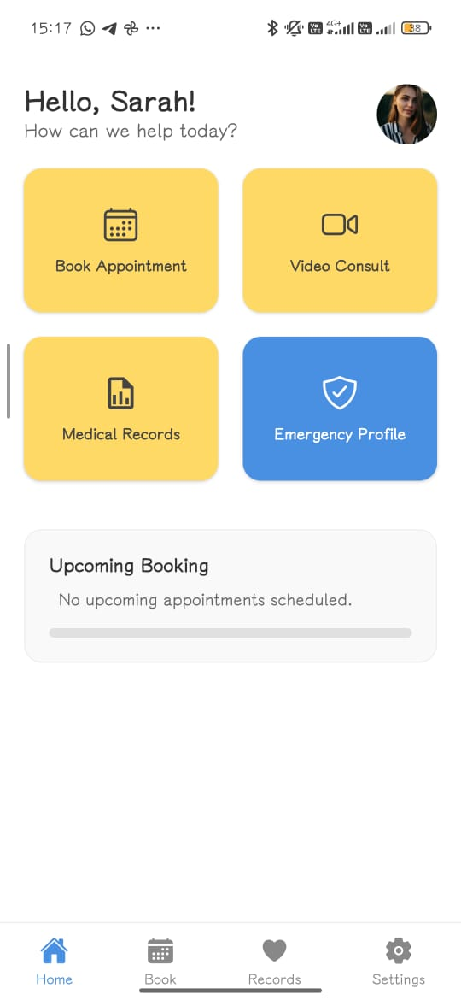
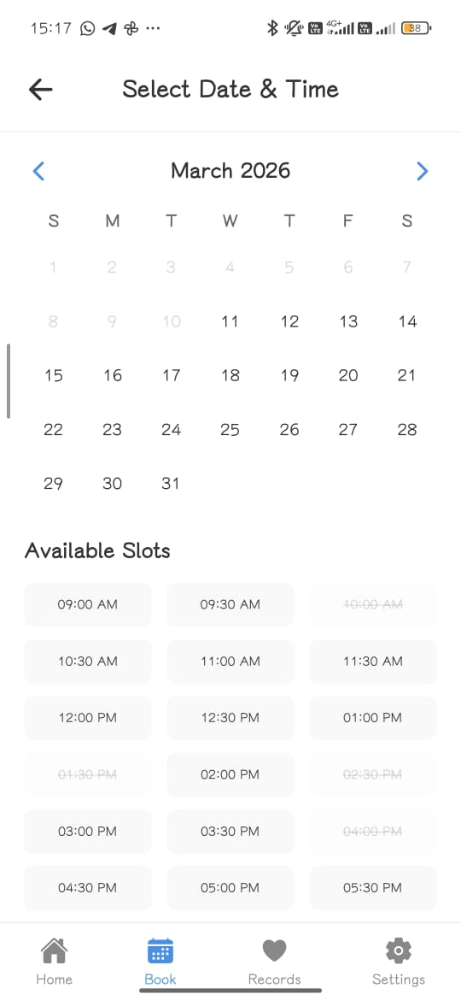
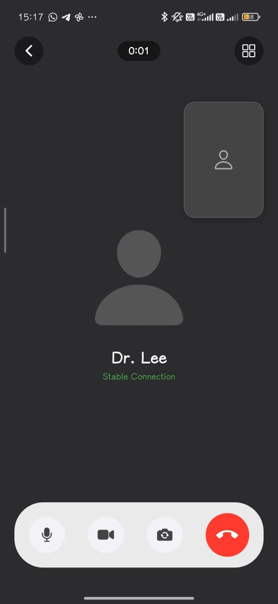
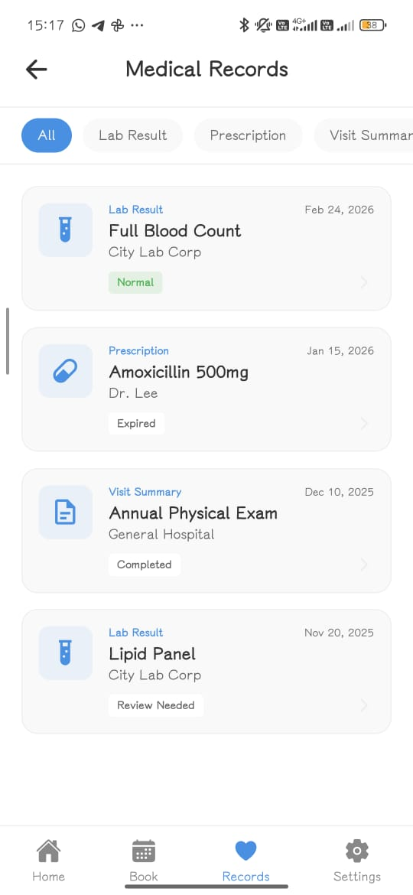
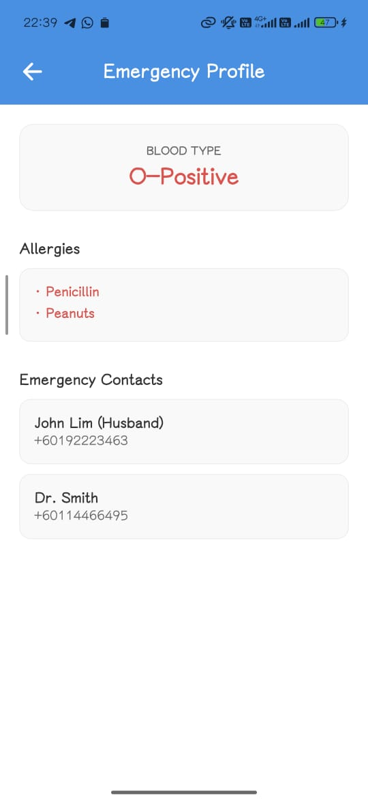
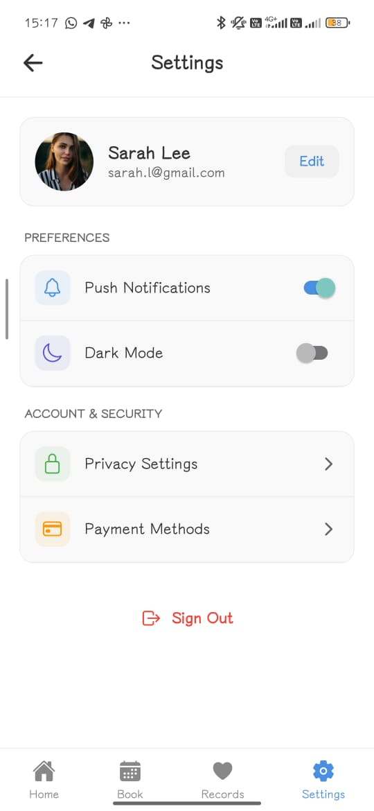

# 🏥 MyHealth — Digital Healthcare Superapp

**MyHealth** is a centralized healthcare superapp designed to modernize Malaysia’s public healthcare experience. It connects patients, hospitals, and medical data into one seamless digital ecosystem—reducing waiting times, improving accessibility, and enhancing patient safety.

---

## 🚨 The Problem

Malaysia’s healthcare system faces several critical challenges:

- ⏳ Long waiting times for consultations  
- 📂 Fragmented medical records across hospitals  
- 📞 Manual appointment systems prone to inefficiency  
- 🚑 Delayed access to critical patient data during emergencies  

These issues are not just inconvenient—they can directly impact patient outcomes.

---

## 💡 The Solution

**MyHealth** acts as a **24/7 Digital Healthcare Concierge**, bridging the gap between patients and hospitals through a unified, intuitive platform.

Built with inclusivity in mind:
- 👴 Elderly-friendly interface  
- ♿ Accessible for users with disabilities  
- 📱 Simple and user-friendly design  

---

## 📱 App Preview

<table align="center">
  <tr>
    <td align="center">
       
      <b>Home Screen</b>
    </td>
    <td align="center">
       
      <b>Book an Appointment</b>
    </td>
    <td align="center">
       
      <b>Video Consultation</b>
    </td>
  </tr>
  <tr>
    <td align="center">
       
      <b>Medical Records</b>
    </td>
    <td align="center">
       
      <b>Emergency Profile</b>
    </td>
    <td align="center">
       
      <b>Settings</b>
    </td>
  </tr>
</table>

## 🚀 Core Features

### 📅 e-Appointment System
- Book appointments anytime, anywhere  
- Eliminates physical queues  
- Reduces scheduling errors  
- Arrive only when your doctor is ready  

---

### 📞 Video Consultations
- Attend follow-ups remotely  
- No unnecessary hospital visits  
- Saves time and travel costs  

---

### 📂 Centralized Medical Records
- All your health data in one place:
  - X-rays  
  - Lab reports  
  - Prescriptions  
- Accessible across multiple hospitals  
- Improves diagnosis accuracy  

---

### 🚑 Emergency Profile
- One-tap access to critical health data  
- Includes:
  - Blood type  
  - Allergies  
  - Emergency contacts  
- Enables faster emergency response  

---

## 🌍 Impact

MyHealth improves healthcare systems by:

- ⏱️ Reducing waiting times  
- 🔄 Improving continuity of care  
- 🚑 Enabling faster emergency treatment  
- 📊 Supporting smarter hospital operations  

---

## ⚠️ Disclaimer

This project is a **prototype UI design** created for demonstration purposes.  
It does not represent a fully functional production system and may not include backend integration or real-time data handling.